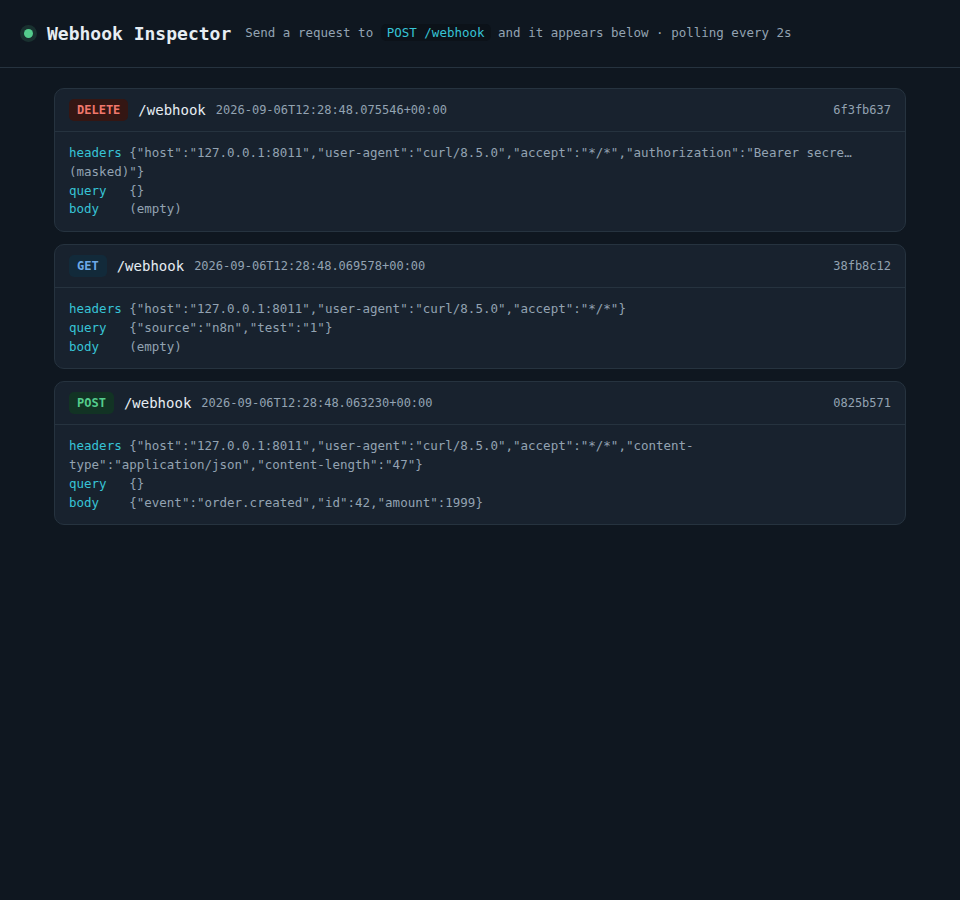
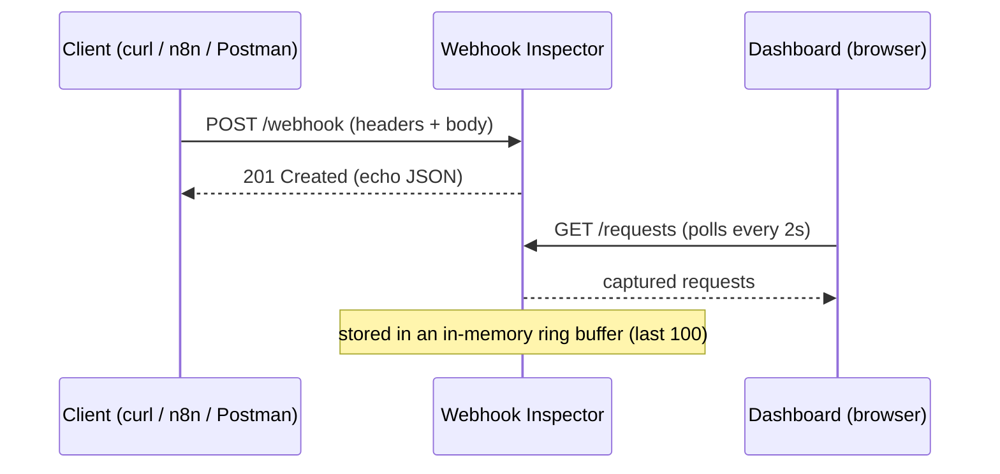

# Webhook Inspector

A FastAPI service that receives, logs and inspects incoming HTTP requests — with proper status codes, idempotency keys, bearer auth and rate limiting.

Point any webhook (n8n, Make, Stripe, or a plain `curl`) at `/webhook` and watch it land on a live dashboard, showing the exact method, headers, query and body that arrived.



> 🎥 **Tip:** replace the screenshot above with a short GIF of a live `curl` request landing on the dashboard.
>
> 🔗 **Live:** _add your deployed URL here (Render / Railway)._

---

## Why I built it

I built this to work hands-on with the fundamentals of HTTP, and because receiving and handling webhooks is the core of the integration and automation work I do. It's small on purpose — the point is that every part of it maps to a real HTTP concept.

## HTTP concepts demonstrated

| Concept | Where it shows up |
| --- | --- |
| **HTTP methods** | `/webhook` accepts GET/POST/PUT/PATCH/DELETE; `/requests` uses GET and DELETE |
| **Status codes** | `201 Created`, `204 No Content`, `401`, `403`, `404`, `429` — each returned deliberately |
| **Headers & bodies** | Every request is captured and echoed; `Authorization` is masked, never stored in full |
| **Idempotency** | An `Idempotency-Key` header makes a repeated request return the first result instead of a duplicate |
| **Authentication vs authorization** | Missing credentials → `401`; valid-but-not-allowed → `403` |
| **Rate limiting** | A sliding window returns `429 Too Many Requests` with a `Retry-After` header |
| **Safe / idempotent methods** | `GET /requests` only reads; `DELETE` mutates and returns `204` |

## How it works



## API reference

| Method | Path | Description | Returns |
| --- | --- | --- | --- |
| `GET/POST/PUT/PATCH/DELETE` | `/webhook` | Capture the incoming request | `201` (or `200` on idempotent replay) |
| `GET` | `/requests?limit=50` | List captured requests, newest first | `200` |
| `GET` | `/requests/{id}` | One captured request | `200` / `404` |
| `DELETE` | `/requests/{id}` | Delete one captured request | `204` / `404` |
| `GET` | `/` | Live dashboard | `200` (HTML) |
| `GET` | `/health` | Health check | `200` |

## Quickstart

```bash
git clone https://github.com/YOUR-HANDLE/webhook-inspector.git
cd webhook-inspector
python -m venv .venv && source .venv/bin/activate     # Windows: .venv\Scripts\activate
pip install -r requirements.txt
uvicorn main:app --reload
```

Open <http://localhost:8000> for the dashboard, then send it some requests:

```bash
# a basic capture
curl -X POST http://localhost:8000/webhook \
  -H "Content-Type: application/json" \
  -d '{"event":"order.created","id":42}'

# idempotency: run this twice — the second returns the first result, no duplicate
curl -X POST http://localhost:8000/webhook \
  -H "Idempotency-Key: abc-123" \
  -d '{"charge":"once"}'

# list what was captured
curl http://localhost:8000/requests

# delete one (use an id from the list above)
curl -X DELETE http://localhost:8000/requests/<id> -i
```

## Configuration

All optional, via environment variables:

| Variable | Default | Effect |
| --- | --- | --- |
| `RATE_LIMIT` | `60` | Max `/webhook` requests per minute per IP before `429` |
| `MAX_STORED` | `100` | How many requests to keep in memory |
| `API_TOKEN` | _(unset)_ | If set, `/webhook` requires `Authorization: Bearer <API_TOKEN>` |
| `ADMIN_TOKEN` | _(unset)_ | If set, `DELETE` requires `Authorization: Bearer <ADMIN_TOKEN>` |

With auth enabled, a request with **no** `Authorization` header gets `401`; a request with the **wrong** token gets `403` — demonstrating the authentication-vs-authorization distinction. (In production a wrong token is often also `401`; they're split here to show both codes.)

## Deploy (free)

**Render** — this repo includes `render.yaml`, so: push to GitHub → New → Blueprint → pick the repo.
**Railway** — the `Procfile` is enough: New Project → Deploy from repo.

Either way the start command is:

```bash
uvicorn main:app --host 0.0.0.0 --port $PORT
```

## Tech stack

Python · FastAPI · Uvicorn. No database — state is in-memory and resets on restart, which is exactly what an inspector wants.

## Possible improvements

- Persist captures to SQLite so they survive a restart
- Server-Sent Events instead of polling for the live dashboard
- Per-endpoint capture URLs (`/webhook/{name}`) to separate sources
- A "replay this request" button

---

Built by **Jay Karippacheril Jacob** · [LinkedIn](https://linkedin.com/in/YOUR-HANDLE) · MIT License
